# CoreAssess Assessment Schema — ER: Old vs New

## OLD (pre-normalization) — ASSESMENT + 22 child tables

```mermaid
erDiagram
    ASSESMENT ||--o{ READ_CRUD : has
    ASSESMENT ||--o{ WRICEF_TYPES : has
    ASSESMENT ||--o{ ASSESSMENT_STANDARD_TABLES : has
    ASSESMENT ||--o{ ASSESSMENT_CUSTOM_TABLES : has
    ASSESMENT ||--o{ NEW_S4_TABLES : has
    ASSESMENT ||--o{ SQL_ANALYSIS_TABLES_DIRECT : has
    ASSESMENT ||--o{ SQL_ANALYSIS_TABLES_API : has
    ASSESMENT ||--o{ SQL_ANALYSIS_TABLES_CDS : has
    ASSESMENT ||--o{ BAPIS : has
    ASSESMENT ||--o{ FUNCTION_MODULES : has
    ASSESMENT ||--o{ INTERFACE_IDOCS : has
    ASSESMENT ||--o{ INTERFACE_STANDARD_API : has
    ASSESMENT ||--o{ USE_CASE_AREA : has
    ASSESMENT ||--o{ USE_CASE_AREA_EXPLANATION : has
    ASSESMENT ||--o{ EVENTS : has
    ASSESMENT ||--o{ STANDARD_EVENTS : has
    ASSESMENT ||--o{ TOPICS : has
    ASSESMENT ||--o{ SAP_STANDARD_API : has
    ASSESMENT ||--o{ SAP_STANDARD_FIORI_APP : has
    ASSESMENT ||--o{ CLEAN_CORE_ANALYSIS : has
    ASSESMENT ||--o{ S4_RECOMMENDATIONS : has
    ASSESMENT ||--o{ INTEGERATION_RESULT : has
    ASSESMENT ||--o{ ASSESSMENT_RECOMMENDATIONS : has
    ASSESMENT ||--o{ BTP_SERVICES : has
    ASSESMENT ||--o{ AUTHORIZATION_CHECK : has
    ASSESMENT ||--o{ FIELD_VALUES : has
    MSTR_PROJECT ||--o{ ASSESMENT : contains

    ASSESMENT {
        Integer ID PK
        Association PROJECT FK
        String OBJECT_NAME
        String APPROACH
        String ADHERENCE
        Integer TOKEN_SIZE
        LargeString RAW_ANALYSIS
    }
    READ_CRUD { UUID ID PK }
    WRICEF_TYPES { UUID ID PK }
    ASSESSMENT_STANDARD_TABLES { UUID ID PK }
    ASSESSMENT_CUSTOM_TABLES { UUID ID PK }
    NEW_S4_TABLES { UUID ID PK }
    SQL_ANALYSIS_TABLES_DIRECT { UUID ID PK }
    SQL_ANALYSIS_TABLES_API { UUID ID PK }
    SQL_ANALYSIS_TABLES_CDS { UUID ID PK }
    BAPIS { UUID ID PK }
    FUNCTION_MODULES { UUID ID PK }
    INTERFACE_IDOCS { UUID ID PK }
    INTERFACE_STANDARD_API { UUID ID PK }
    USE_CASE_AREA { UUID ID PK }
    USE_CASE_AREA_EXPLANATION { UUID ID PK }
    EVENTS { UUID ID PK }
    STANDARD_EVENTS { UUID ID PK }
    TOPICS { UUID ID PK }
    SAP_STANDARD_API { UUID ID PK }
    SAP_STANDARD_FIORI_APP { UUID ID PK }
    CLEAN_CORE_ANALYSIS {
        UUID ID PK
        String TITLE
        String DESCRIPTION
    }
    S4_RECOMMENDATIONS {
        UUID ID PK
        String TITLE
        String DESCRIPTION
    }
    INTEGERATION_RESULT {
        UUID ID PK
        String TITLE
        String DESCRIPTION
    }
    ASSESSMENT_RECOMMENDATIONS {
        UUID ID PK
        String TITLE
        String DESCRIPTION
    }
    BTP_SERVICES { Integer ID PK }
    AUTHORIZATION_CHECK { UUID ID PK }
    FIELD_VALUES { UUID ID PK }
```

**Problem:** 18 single-column "value" tables (same shape: `ID, ASSESMENT_FK, one_string`) + 4 title/description "note" tables (same shape: `ID, ASSESMENT_FK, TITLE, DESCRIPTION`). 22 joins on read, 22 inserts on write, 22 deletes on cleanup. Inconsistent FK naming (`ASSESMENT` vs `ASSESMENT_ID` vs `ASSESSMENT`).

---

## NEW (normalized) — ASSESMENT + ASSESSMENT_ITEM + ASSESSMENT_NOTE + ASSESSMENT_USAGE

```mermaid
erDiagram
    MSTR_PROJECT ||--o{ ASSESSMENT : contains
    ASSESSMENT ||--o{ ASSESSMENT_ITEM : "many (by KIND)"
    ASSESSMENT ||--o{ ASSESSMENT_NOTE : "many (by KIND)"
    ASSESSMENT ||--o| ASSESSMENT_USAGE : "one (tokens/cost)"
    ASSESSMENT ||--o{ BTP_SERVICES : has
    ASSESSMENT ||--o{ AUTHORIZATION_CHECK : has
    ASSESSMENT ||--o{ FIELD_VALUES : has
    ASSESSMENT ||--o{ FEEDBACK : "rated by users"
    ASSESSMENT ||--o{ APP_LOG : "logged events"
    ASSESSMENT ||..o{ LLMChatHistory : "docgen drafts/versions (by id, not FK)"
    LLMChatHistory ||--o{ FEEDBACK : "chat votes"
    MSTR_PROJECT ||--o{ FEEDBACK : scopes
    MSTR_PROJECT ||--o{ APP_LOG : scopes
    ASSESSMENT ||..o{ COST_LEDGER : "cost snapshot on delete (no FK: survives purge)"

    ASSESSMENT {
        Integer ID PK
        Association PROJECT FK
        String OBJECT_NAME
        String APPROACH
        String APPROACH_REASON
        String ADHERENCE
        String ADHERENCE_REASON
        String CLEANCORE_TIER "current A-D"
        String CLEANCORE_TIER_REASON
        String CLEANCORE_TARGET_TIER "achievable A-D"
        String CLEANCORE_TARGET_TIER_REASON
        String COUPLING
        Integer Efforts "loaded HOURS"
        String TShirt "XS-XL from TSHIRT bands"
        String USE_CASE_AREA_EXPLANATION
        String INTEGRATION_MODERNIZATION
        Integer TOKEN_SIZE
        LargeString RAW_ANALYSIS
        LargeString SOURCE_CODE "kept for DocGen deep analysis"
        LargeString DEEP_SPEC "cached deep-analysis extraction"
        String SOURCE_FILES "analysed file names (display only)"
        LargeString DETAILEDBREAKDOWN
        LargeString SCOREANALYSIS
    }
    ASSESSMENT_ITEM {
        UUID ID PK
        Association ASSESMENT FK
        ItemKind KIND "18 kinds: CRUD/WRICEF/STANDARD_TABLE/CUSTOM_TABLE/S4_TABLE/SQL_DIRECT/SQL_API/SQL_CDS/BAPI/FUNCTION_MODULE/IDOC/INTERFACE_API/STANDARD_API/FIORI_APP/USE_CASE_AREA/EVENT/STANDARD_EVENT/TOPIC"
        String VALUE "technical name"
        String MAPPING "OLD to NEW (S4/API)"
        String DESCRIPTION
        String VERIFY "grounding provenance"
    }
    ASSESSMENT_NOTE {
        UUID ID PK
        Association ASSESMENT FK
        NoteKind KIND "CLEAN_CORE / S4_RECOMMENDATION / INTEGRATION / RECOMMENDATION"
        String TITLE
        LargeString DESCRIPTION
    }
    ASSESSMENT_USAGE {
        UUID ID PK
        Association ASSESMENT FK
        Integer INPUT_TOKENS
        Integer OUTPUT_TOKENS
        Integer TOTAL_TOKENS
        Integer LLM_CALLS
        Decimal COST_USD
    }
    BTP_SERVICES {
        Integer ID PK
        Association ASSESMENT_ID FK
        String SERVICE_NAME
        Integer BLOCKS_REQUIRED
        String UNITPRICE
    }
    AUTHORIZATION_CHECK {
        UUID ID PK
        Association ASSESSMENT FK
        String AUTHOBJECT
        String FIELDSCHECKED
    }
    FIELD_VALUES {
        UUID ID PK
        Association ASSESSMENT FK
        String ACTVT
        String OBTYP
    }
    FEEDBACK {
        UUID ID PK
        FeedbackSource SOURCE "ASSESSMENT / DOCGEN_CHAT"
        Association ASSESMENT FK "both sources"
        Association PROJECT FK
        Association CHAT FK "DOCGEN_CHAT only"
        String DOC_TYPE "FSD/TSD/BBP"
        Integer UPVOTES
        Integer DOWNVOTES
        String COMMENT "free text, max 2000"
        String USER "upsert per user+target"
        DateTime createdAt "managed"
    }
    APP_LOG {
        UUID ID PK
        LogLevel LEVEL "DEBUG/INFO/WARN/ERROR"
        LogSource SOURCE "CAP/ANALYSIS_API/DOCGEN_API/UI"
        String ACTION "UploadObject / analyze / generateDoc"
        String MESSAGE "max 1000"
        LargeString CONTEXT "JSON detail"
        String USER
        Association ASSESMENT FK "nullable"
        Association PROJECT FK "nullable"
        DateTime createdAt "managed"
    }
    LLMChatHistory {
        Integer ID PK
        String assessmentID "id, not a DB FK"
        String projectID
        String docType "FSD/TSD/BBP"
        String prompt
        LargeString response "the generated/edited doc HTML"
        Boolean IS_SAVED "draft=false; saved version=true (shown in picker)"
        Timestamp CREATED_AT "backs the version label"
        Integer totalTokens
        Decimal costUsd
        Integer upvotes
        Integer downvotes
    }
    COST_LEDGER {
        UUID ID PK
        Integer ASSESSMENT_ID "denormalized (source may be deleted)"
        String OBJECT_NAME
        Integer PROJECT_ID
        String PROJECT_NAME
        Integer COMPANY_ID
        String COMPANY_NAME
        String INCURRED_BY
        String SOURCE "ANALYSIS / DOCGEN"
        Integer TOTAL_TOKENS
        Decimal COST_USD
        Timestamp DELETED_AT
        String DELETED_BY
    }
```

**Result:** 22 child tables → 3 (`ASSESSMENT_ITEM`, `ASSESSMENT_NOTE`, `ASSESSMENT_USAGE`) + 3 kept dedicated tables (`BTP_SERVICES`, `AUTHORIZATION_CHECK`, `FIELD_VALUES`). Read = 2 queries bucketed by `KIND` in code; write = 2 batched inserts. New `ASSESSMENT_USAGE` captures token/cost telemetry that had no home before. UI contract preserved: `bucketItems()`/`bucketNotes()` rebuild the exact legacy field names (`WRICEF_OBJECT_TYPE`, `STANDARD_TABLES`, `BAPIS`, `HIGH_LVL_RECOMMENDATIONS`, …).

## Later additions

- **Clean Core tiers on `ASSESSMENT`** — `CLEANCORE_TIER` / `_REASON` (current A–D) and `CLEANCORE_TARGET_TIER` / `_REASON` (achievable after the recommended approach), each with a plain-language justification. Stored as `String` (not LOB) so raw-SQL reads return text.
- **DocGen source fields on `ASSESSMENT`** — `SOURCE_CODE` (kept for deep analysis), `DEEP_SPEC` (cached deep extraction), `SOURCE_FILES` (analysed file names, display-only).
- **`LLMChatHistory`** — one row per docgen generate/refine. A working **draft** (`IS_SAVED=false`, still tracked for cost) becomes a **version** only on explicit Save (`IS_SAVED=true`); the version picker lists saved rows. `costUsd`/`totalTokens` feed project docgen spend.
- **`COST_LEDGER`** — retained pricing/cost audit. On delete of an assessment / project / company, the spend is snapshotted here **before** the cascade purge (names denormalized, no FK) so a superuser can't erase cost by deleting. The live "Project-wise cost" stays live-only; deleted cost lives here.
- **`ASSESSMENT_USAGE.BY_MODEL` removed** — per-model breakdown dropped; the per-run totals remain.

